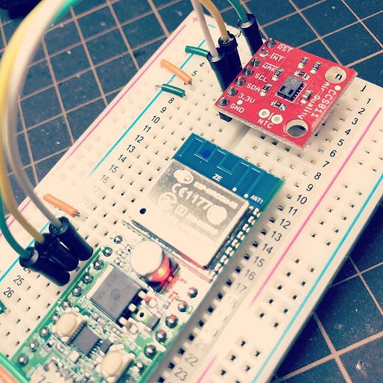
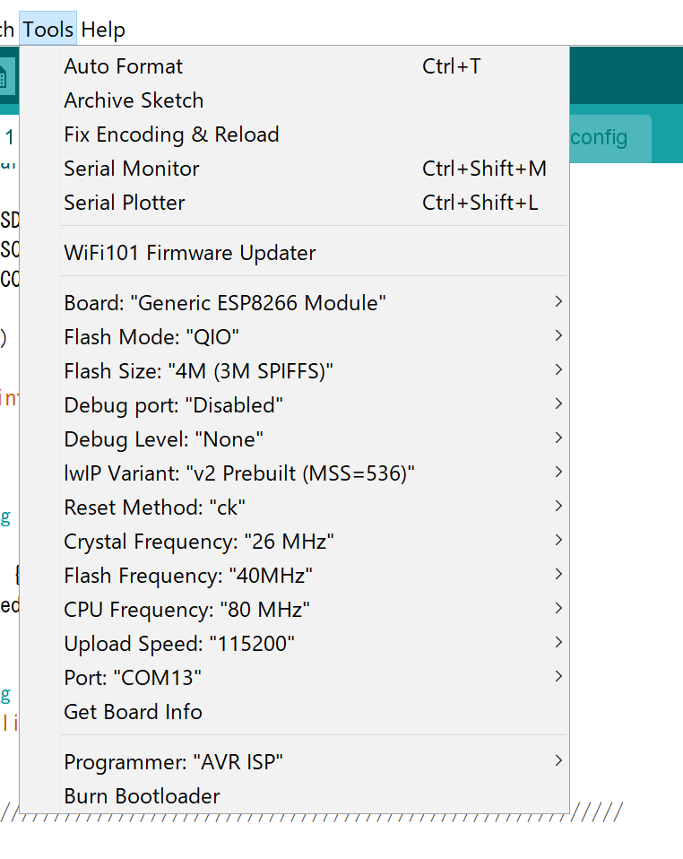

mqtt-ccs811-pub
====

  - 

Requirements
----

  - Akiduki ESP-WROOM-02 development board
    - http://akizukidenshi.com/catalog/g/gK-12236/
  
  - SparkFun Air Quality Breakout - CCS811
    - https://www.sparkfun.com/products/14193

  - Arduino Client for MQTT 
    - https://github.com/knolleary/pubsubclient/

How to
----

    $ git clone https://github.com/yoggy/mqtt-ccs811-pub.git
    $ mqtt-ccs811-pub
    $ cp config.ino.sample config.ino
    $ vi config.ino
    ※ edit mqtt_host, mqtt_username, mqtt_password, mqtt_topic...
    $ open mqtt-ccs811-pub.ino

settings for Akiduki ESP-WROOM-02 development board

  - 

Copyright and license
----
Copyright (c) 2018 yoggy

Released under the [MIT license](LICENSE.txt)